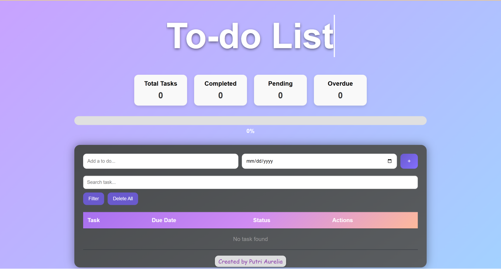
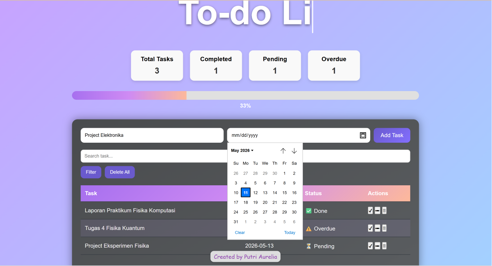
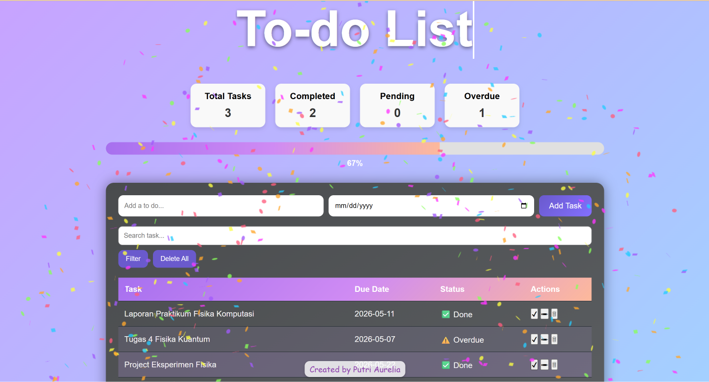

# ✨ Interactive To-Do List

🚀 An interactive To-Do List built with **HTML, CSS, and JavaScript**, developed during **RevoU’s Intro to Software Engineering course**.  

Manage your daily tasks efficiently with a clean interface and real-time interactions.

🎉 **Fun Feature**: Complete a task and enjoy a satisfying **confetti celebration!**

---

## 🌐 Live Demo

👉 **Try it now:**  
🔗 https://putrilia12.github.io/To-Do-List/

---

## 🎯 Features

- ➕ **Add Tasks** with optional deadlines  
- ✏️ **Edit Tasks** anytime  
- 🗑️ **Delete Tasks** easily  
- ✅ **Mark as Complete** (with confetti 🎉)  
- 🔍 **Search Tasks** instantly  
- 📊 **Task Status Tracking**:
  - 🟢 **Pending**
  - 🔴 **Overdue**
  - ✅ **Done**
- 📱 **Responsive Design** (Desktop & Mobile)

---

## 🎮 How It Works

1. Type your task  
2. Set a deadline (optional)  
3. Click **Add** or press **Enter**  
4. Manage tasks with:
   - ✏️ Edit  
   - 🗑️ Delete  
   - ✅ Complete  
5. Watch the **confetti 🎉** when you finish a task!

---

## 📸 Preview

### 🏠 Initial Interface

### ✍️ Task Interaction

### 🎉 Confetti Celebration

---

## ⚙️ Technologies Used

- HTML5  
- CSS3  
- JavaScript (ES6)  

---

## 💡 Why This Project?

This project demonstrates:
- Interactive UI design  
- DOM manipulation  
- Event handling  
- Real-time user feedback  

---

## 👩‍💻 Author

**Putri Aurelia**  
🔗 https://www.linkedin.com/in/putri-aurelia-728abb342/

---
